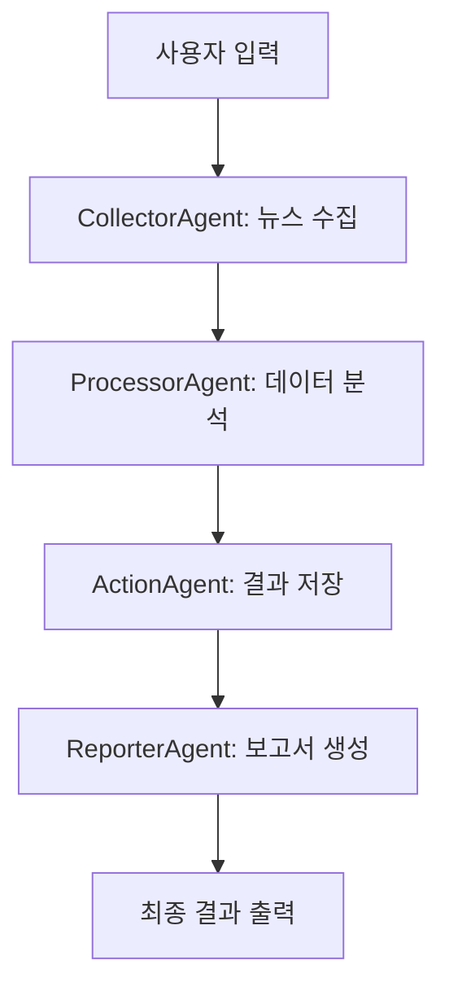

# 뉴스 스크래핑 채팅 애플리케이션 사용법

## 📋 개요
채팅 입력을 통해 뉴스 키워드나 주제를 입력하면, 4개의 전문 에이전트가 협력하여 관련 뉴스를 수집, 분석, 정리하고 보고서를 생성하는 시스템입니다.

## 🤖 에이전트 구성
1. **CollectorAgent**: 웹 정보 수집 전문가
2. **ProcessorAgent**: 데이터 분석 및 처리 전문가  
3. **ActionAgent**: 행동 실행 및 파일 저장 전문가
4. **ReporterAgent**: 보고서 생성 및 저장 전문가

## 🚀 실행 방법

### 1. 환경 설정
```bash
# 1. Anthropic API 키 설정
cp env_example.txt .env
# .env 파일에서 ANTHROPIC_API_KEY를 실제 API 키로 변경

# 2. 필요한 패키지 설치
pip install -r requirements.txt
```

### 2. 애플리케이션 실행
```bash
# 메인 애플리케이션 실행
python chat_main.py

# 또는 실행 스크립트 사용
python run_chat.py
```

## 💬 사용 예시

### 입력 예시:
- `AI 기술 동향 뉴스`
- `삼성전자 주가 관련 뉴스`
- `코로나19 최신 소식`
- `암호화폐 비트코인 뉴스`
- `K-팝 글로벌 트렌드`

### 명령어:
- `help` 또는 `도움말`: 사용법 표시
- `quit`, `exit`, `종료`, `q`: 프로그램 종료

## 📊 워크플로우



## 📁 출력 파일

### 저장 위치:
- `saved_reports/`: ActionAgent가 처리된 데이터를 JSON과 텍스트로 저장
- `reports/`: ReporterAgent가 최종 보고서를 저장

### 파일 형식:
- **JSON 파일**: 전체 처리 데이터 (구조화된 형태)
- **텍스트 파일**: 사용자 친화적인 요약 및 보고서

## 🔧 설정 옵션

### config/agent_config.py:
- `CLAUDE_MODEL`: 사용할 Claude 모델 (기본: claude-3-5-sonnet-20241022)
- `MAX_PAGES_TO_SCRAPE`: 스크랩할 최대 페이지 수
- `MAX_CONTENT_LENGTH`: 최대 콘텐츠 길이
- `SUMMARIZATION_LENGTH`: 요약 길이

## 🚨 주의사항

1. **API 키 필수**: Anthropic API 키가 없으면 Mock 클라이언트가 사용됩니다
2. **네트워크 연결**: 웹 스크래핑을 위해 인터넷 연결이 필요합니다
3. **저장 공간**: 결과 파일들이 누적되므로 주기적인 정리가 필요합니다

## 🔍 트러블슈팅

### 일반적인 문제:
1. **API 키 오류**: `.env` 파일의 `ANTHROPIC_API_KEY` 확인
2. **패키지 누락**: `pip install -r requirements.txt` 재실행
3. **웹 스크래핑 실패**: 네트워크 연결 및 방화벽 설정 확인

### 로그 확인:
애플리케이션 실행 중 콘솔에 표시되는 상태 메시지를 통해 각 단계의 진행 상황을 확인할 수 있습니다.

## 🎯 주요 기능

- ✅ 실시간 채팅 인터페이스
- ✅ 4단계 에이전트 워크플로우
- ✅ 자동 웹 스크래핑 및 데이터 수집
- ✅ AI 기반 내용 분석 및 인사이트 생성
- ✅ 결과 파일 자동 저장 (JSON + 텍스트)
- ✅ 사용자 친화적인 진행 상황 표시
- ✅ 오류 처리 및 복구 메커니즘