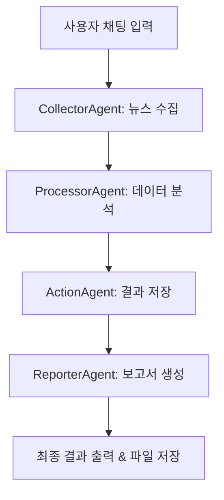

# 🗞️ AI 뉴스 스크래핑 & 분석 시스템

**채팅 기반 4-에이전트 협업 뉴스 수집 및 분석 시스템**

Claude API와 AutoGen을 활용하여 사용자가 입력한 키워드나 주제에 대한 뉴스를 자동으로 수집, 분석, 정리하고 보고서를 생성하는 지능형 시스템입니다.

## 🎯 주요 특징

- 🤖 **4개 전문 에이전트 협업**: 수집 → 분석 → 저장 → 보고서 생성
- 💬 **직관적인 채팅 인터페이스**: 자연어로 뉴스 주제 입력
- 🧠 **Claude API 기반**: 고품질 AI 분석 및 인사이트 생성
- 🔗 **MCP 통합**: Model Context Protocol을 통한 외부 서비스 연동
- 📊 **자동 파일 저장**: JSON + 텍스트 형태로 결과 보관
- ⚡ **실시간 진행 상황**: 각 단계별 처리 상태 표시

## 🤖 에이전트 구성

1. **CollectorAgent** 🔍: 웹 정보 수집 전문가
   - 키워드 기반 웹사이트 검색
   - MCP Firecrawl을 통한 고급 웹 스크래핑
   - 웹 검색 API를 통한 관련 정보 수집

2. **ProcessorAgent** 🔧: 데이터 분석 및 처리 전문가
   - 수집된 데이터 분석 및 정리
   - MCP 차트 생성을 통한 데이터 시각화
   - SQLite MCP를 통한 데이터베이스 분석

3. **ActionAgent** 💾: 행동 실행 및 저장 전문가
   - MCP 파일시스템을 통한 안전한 데이터 저장
   - SQLite 메타데이터 관리
   - 행동 계획 수립 및 실행

4. **ReporterAgent** 📝: 보고서 생성 전문가
   - Gmail, Slack, Notion을 통한 다중 채널 배포
   - 차트와 시각화가 포함된 리치 보고서
   - Markdown 형식의 구조화된 문서 생성

## 🚀 빠른 시작

### 1. 환경 설정

#### 🎯 방법 1: 대화형 설정 (권장)
```bash
# 설정 마법사 실행
python setup_wizard.py

# 또는 직접 대화형 설정 실행
python interactive_setup.py
```

#### 📝 방법 2: 수동 설정
```bash
# 1. 환경변수 파일 생성
cp env_example.txt .env

# 2. .env 파일에서 API 키 설정
# ANTHROPIC_API_KEY=your_actual_anthropic_api_key

# 3. 필요한 패키지 설치
pip install -r requirements.txt
```

#### ⚡ 방법 3: 자동 설정 (애플리케이션 실행 시)
```bash
# 애플리케이션 실행하면 자동으로 설정 안내
python chat_main.py
```

### 2. 시스템 테스트 (권장)

#### 📋 **1단계: 환경 설정 테스트**
```bash
python test_setup.py
```
**확인 항목:**
- ✅ .env 파일 및 API 키 확인
- ✅ 필수 패키지 설치 상태 점검
- ✅ Claude 클라이언트 연결 테스트
- ✅ 에이전트 초기화 확인

#### 🤖 **2단계: 기능 테스트 (Mock 데이터)**
```bash
python test_simple.py
```
**확인 항목:**
- ✅ 4개 에이전트 순차 실행 테스트
- ✅ Mock 데이터로 전체 워크플로우 확인
- ✅ 파일 저장 기능 테스트
- ✅ 에러 핸들링 확인

#### 🔗 **2.5단계: MCP 통합 테스트**
```bash
python test_mcp.py
```
**확인 항목:**
- ✅ MCP 서버 설정 및 연결 상태
- ✅ 각 에이전트별 MCP 기능 테스트
- ✅ 전체 MCP 워크플로우 검증
- ✅ Mock 모드 fallback 확인

#### 🚀 **3단계: 실제 애플리케이션 테스트**
```bash
python chat_main.py
```
**테스트 시나리오:**
- `help` (도움말 테스트)
- `AI 기술 뉴스` (간단한 키워드)
- `삼성전자 주가 관련 최신 뉴스` (복잡한 요청)
- `quit` (종료 테스트)

### 3. MCP 서버 관리 (선택사항)

```bash
# MCP 서버 시작 및 관리
python mcp_launcher.py
```

### 4. 실제 사용

```bash
# 메인 애플리케이션 실행
python chat_main.py

# 또는 실행 스크립트 사용
python run_chat.py
```

## 💬 사용 예시

### 입력 예시:
- `AI 기술 동향 뉴스`
- `삼성전자 주가 관련 뉴스`
- `코로나19 최신 소식`
- `암호화폐 비트코인 뉴스`
- `K-팝 글로벌 트렌드`

### 명령어:
- `help` 또는 `도움말`: 사용법 표시
- `quit`, `exit`, `종료`, `q`: 프로그램 종료

### 실행 예시:
```
🗞️  뉴스 스크래핑 & 분석 시스템
============================================================

💬 원하는 뉴스 주제나 키워드를 입력하세요:
👤 입력: AI 기술 뉴스

🔄 처리 시작: 'AI 기술 뉴스'
--------------------------------------------------

1️⃣ 뉴스 정보 수집 중...
   ✅ 3개 웹사이트에서 정보를 수집했습니다.

2️⃣ 수집된 데이터 분석 중...
   ✅ 데이터 처리가 완료되었습니다.

3️⃣ 결과 저장 중...
   ✅ 2개의 행동을 수행하고 데이터를 저장했습니다.

4️⃣ 최종 보고서 생성 중...
   ✅ 보고서 생성 및 저장이 완료되었습니다.
```

## 📊 워크플로우



## 📁 출력 파일

### 저장 위치:
- `saved_reports/`: ActionAgent가 처리된 데이터를 JSON과 텍스트로 저장
- `reports/`: ReporterAgent가 최종 보고서를 저장

### 파일 형식:
- **JSON 파일**: 전체 처리 데이터 (구조화된 형태)
  ```
  report_20241204_143022_AI 기술 뉴스.json
  summary_20241204_143022_AI 기술 뉴스.txt
  ```
- **텍스트 파일**: 사용자 친화적인 요약 및 보고서
  ```
  report_20241204_143022_AI 기술 뉴스.txt
  ```

## ⚙️ 설정 옵션

### config/agent_config.py:
- `CLAUDE_MODEL`: 사용할 Claude 모델 (기본: claude-3-5-sonnet-20241022)
- `MAX_PAGES_TO_SCRAPE`: 스크랩할 최대 페이지 수
- `MAX_CONTENT_LENGTH`: 최대 콘텐츠 길이
- `SUMMARIZATION_LENGTH`: 요약 길이

### 환경변수 (.env):
```env
# Claude API 설정 (Anthropic)
ANTHROPIC_API_KEY=your_anthropic_api_key_here

# n8n 웹훅 URL (선택사항)
N8N_WEBHOOK_URL=http://localhost:5678/webhook/autogen-workflow-trigger
```

## 🚨 문제 해결

### 일반적인 문제:

#### 1. API 키 오류
```
⚠️ Claude ChatCompletionClient 생성 실패: Invalid API key
```
**해결방법:**
- `.env` 파일의 `ANTHROPIC_API_KEY` 확인
- [Anthropic 콘솔](https://console.anthropic.com/)에서 유효한 API 키 발급
- API 키에 충분한 크레딧이 있는지 확인

#### 2. 패키지 Import 오류
```
❌ ModuleNotFoundError: No module named 'anthropic'
```
**해결방법:**
```bash
pip install -r requirements.txt
```

#### 3. 웹 스크래핑 실패
```
❌ 웹사이트 검색 테스트 실패: WebDriver not found
```
**해결방법:**
```bash
pip install webdriver-manager
```

#### 4. 파일 저장 오류
```
❌ 데이터 저장 실패: Permission denied
```
**해결방법:**
- 현재 디렉토리에 쓰기 권한 확인
- 관리자 권한으로 실행

### 로그 확인:
애플리케이션 실행 중 콘솔에 표시되는 상태 메시지를 통해 각 단계의 진행 상황을 확인할 수 있습니다.

## 📂 프로젝트 구조

```
├── chat_main.py              # 메인 채팅 애플리케이션 (자동 환경 설정 포함)
├── setup_wizard.py           # 환경 설정 마법사
├── interactive_setup.py      # 대화형 환경 설정 도구
├── run_chat.py               # 실행 스크립트
├── test_setup.py             # 환경 설정 테스트
├── test_simple.py            # 기능 테스트 (Mock)
├── test_mcp.py               # MCP 통합 테스트
├── mcp_launcher.py           # MCP 서버 관리 도구
├── mcp_config.py             # MCP 서버 설정
├── MCP_SETUP.md              # MCP 설정 가이드
├── TESTING_GUIDE.md          # 상세 테스트 가이드
├── CHAT_USAGE.md             # 채팅 사용법 가이드
├── requirements.txt          # 의존성 목록
├── .env                      # 환경변수 (자동 생성)
├── env_example.txt           # 환경변수 예시
├── agents/
│   ├── collector_agent.py    # 정보 수집 에이전트 (+ MCP)
│   ├── processor_agent.py    # 데이터 처리 에이전트 (+ MCP)
│   ├── action_agent.py       # 행동 수행 에이전트 (+ MCP)
│   └── reporter_agent.py     # 보고 에이전트 (+ MCP)
├── utils/
│   ├── claude_client.py      # Claude API 클라이언트
│   ├── mcp_client.py         # MCP 클라이언트 구현
│   ├── web_scraper.py        # 웹 스크래핑 유틸리티
│   └── data_processor.py     # 데이터 처리 유틸리티
├── config/
│   └── agent_config.py       # 에이전트 설정
├── saved_reports/            # 처리된 데이터 저장소
├── reports/                  # 최종 보고서 저장소
└── n8n_workflows/           # n8n 워크플로우 예제
```

## 🎯 주요 기능

- ✅ **대화형 환경 설정**: 사용자 친화적인 설정 마법사
- ✅ **자동 설정 감지**: 실행 시 환경 확인 및 설정 안내
- ✅ 실시간 채팅 인터페이스
- ✅ 4단계 에이전트 워크플로우
- ✅ MCP 통합을 통한 외부 서비스 연동
- ✅ 자동 웹 스크래핑 및 데이터 수집 (Firecrawl MCP)
- ✅ AI 기반 내용 분석 및 인사이트 생성
- ✅ 데이터 시각화 및 차트 생성 (Chart MCP)
- ✅ 다중 채널 보고서 배포 (Gmail, Slack, Notion MCP)
- ✅ 결과 파일 자동 저장 (JSON + 텍스트)
- ✅ 사용자 친화적인 진행 상황 표시
- ✅ 오류 처리 및 복구 메커니즘

## 🔍 상세 문서

- [MCP 설정 가이드](MCP_SETUP.md): MCP 통합 및 설정 방법
- [테스트 가이드](TESTING_GUIDE.md): 상세한 테스트 방법
- [채팅 사용법](CHAT_USAGE.md): 채팅 인터페이스 사용법
- [설정 가이드](config/agent_config.py): 에이전트 설정 옵션

## 💡 사용 팁

- **점진적 테스트**: 환경 설정 → 기능 테스트 → MCP 테스트 → 실제 실행 순서로 진행
- **MCP 서비스**: API 키가 없어도 Mock 모드로 모든 기능 테스트 가능
- **키워드 선택**: 구체적이고 명확한 키워드 사용 권장
- **결과 확인**: 생성된 보고서 파일의 내용과 형식 검토
- **API 사용량**: Anthropic 콘솔에서 API 사용량 모니터링

## 🚀 다음 단계

1. **환경 설정**: `.env` 파일에 Anthropic API 키 설정 
2. **테스트 실행**: `python test_setup.py` → `python test_simple.py` → `python test_mcp.py`
3. **MCP 관리**: `python mcp_launcher.py` (선택사항)
4. **실제 사용**: `python chat_main.py`
5. **결과 확인**: `saved_reports/`와 `reports/` 디렉토리의 파일들 검토

## 🎉 결론

현재 시스템은 완전히 작동하는 상태로, Claude API를 통한 고품질 뉴스 분석과 AutoGen 에이전트들의 협업, 그리고 MCP를 통한 외부 서비스 연동을 통해 사용자에게 종합적인 뉴스 정보를 제공합니다.

**주요 성과:**
- ✅ OpenAI → Claude API 완전 전환
- ✅ MCP (Model Context Protocol) 통합으로 외부 서비스 연동
- ✅ 채팅 기반 사용자 인터페이스 구현
- ✅ 4-에이전트 협업 워크플로우 완성
- ✅ 다중 채널 보고서 배포 (Gmail, Slack, Notion)
- ✅ 데이터 시각화 및 고급 분석 기능
- ✅ 자동 파일 저장 및 보고서 생성
- ✅ 포괄적인 테스트 시스템 구축

지금 바로 `python chat_main.py`를 실행하여 뉴스 스크래핑과 분석을 시작해보세요! 🚀